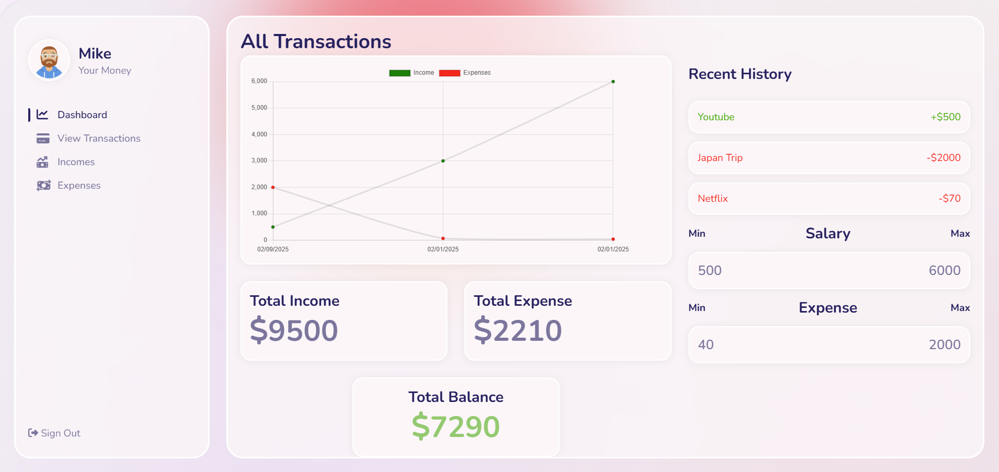
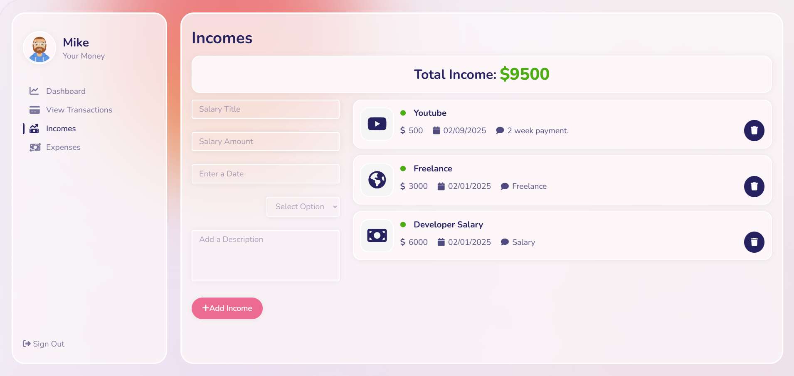
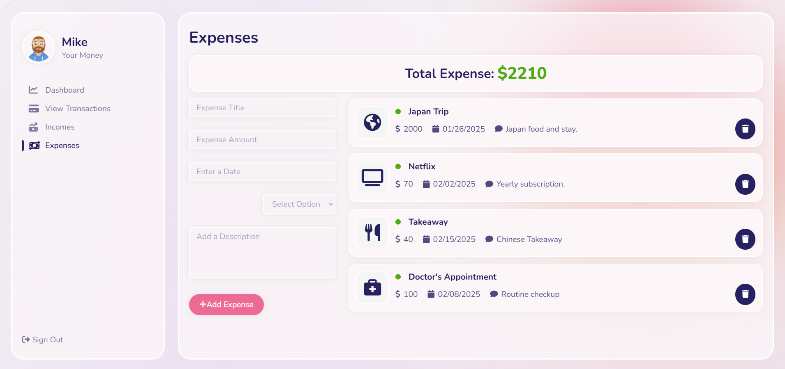

# Expense Tracker

An expense tracker app that helps users track their daily expenses. The application allows users to add and delete expenses, providing a simple and effective way to manage personal finances.

## Screenshots





## Features

- **Add Income / Expense**: Users can add new expenses with details like name, amount, and date.
- **Delete Income / Expense**: Expenses can be removed from the tracker.
- **Line Graph Visualization**: Displays income and expense data in a line graph to show trends over time.

## Technologies Used

- **Frontend**:
  - React.js
  - HTML, CSS, JavaScript
- **Charting**:
  - Chart.js (Line graph)
- **State Management**:
  - React State
- **Development**:
  - Node.js (For development purposes)

## Installation

To get the project running locally, follow these steps:

1. Clone the repository:

   ```bash
   git clone https://github.com/nehasaleemdesai/expense-tracker.git

   ```

2. Navigate into the project directory:

   ```bash
   cd expense-tracker

   ```

3. Install dependencies:

   ```bash
   npm install

   ```

4. Setup Environment Variables:
   In the backend server folder, create a .env file and define the necessary variables such as:

   ```bash
   MONGO_URI=your_mongo_db_uri
   PORT=5000

   ```

5. Start the backend server:

   ```bash
   cd backend
   npm start

   ```

6. Start the frontend:

   ```bash
   cd frontend
   npm start

   ```

7. Open the application

Once both servers are running, open your browser and go to http://localhost:3000 to use the application.

## Future Improvements

- **Night Mode**: Implement a dark theme toggle for improved user experience, especially in low-light environments.
- **User Authentication**: Add signup and login functionality with JWT authentication for secure access to personal data.
- **Edit Expense/Income**: Add functionality to edit expenses and incomes after they’ve been added, offering users greater flexibility.
- **Responsiveness**: Improve the user interface to ensure the app is fully responsive and optimized for mobile and tablet devices.

## Contributing

Feel free to fork the repository, make improvements, and submit pull requests. If you'd like to contribute, open an issue or submit a feature request!
